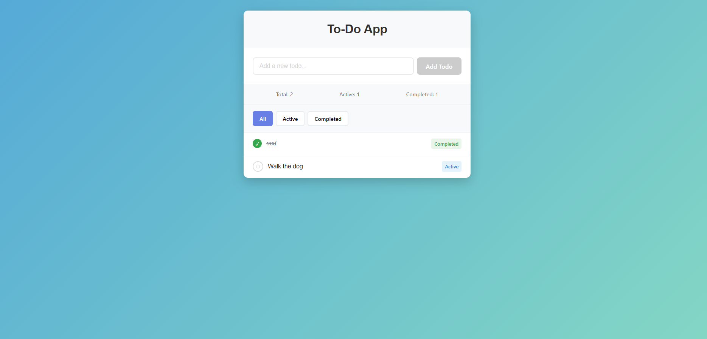

# Simple-React-To-Do-List-with-Filtering
This is a simple a react to-do app.



## Features

- 📝 **Create**: The user is able to create a to-do item with text
- 🔍 **Read**: User can see all the to-do's from the in-memory storage.
- ❎ **Mark Completed/Active**: User can mark certain to-do item as completed or active.
- ❎ **Filter To-do's**: User can filter by their status.


## Technologies Used

- Vite
- React
- TypeScript + SWC

## Dependencies
- react 
- react-dom 

## Dev-Dependencies

- @eslint/js 
- @types/react 
- @types/react-dom 
- @vitejs/plugin-react-swc 
- eslint 
- eslint-plugin-react-hooks 
- eslint-plugin-react-refresh 
- globals 
- typescript 
- typescript-eslint 
- vite 

### Other Tools

- Git/GitHub

## Installation

1. Clone the repository:
   ```bash
   git clone https://github.com/superGemHere/Simple-React-To-Do-List-with-Filtering
   ```
2. Navigate to client folder:
   ```bash
   cd ./client
   ```
3. Install dependencies:
   ```bash
   npm install
   ```
4. Run the server with npm or pnpm:
   ```bash
   npm run dev / pnpm dev
   ```
